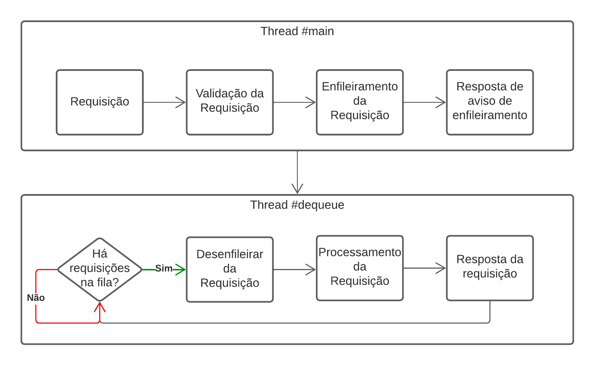

# LazyProcess

Uma solução para requisições que demandam um tempo razoável de processamento. Assim, evitando o 408 Request Timeout

## O problema de Jony e o sonho de Alexa

Jony construiu um algoritmo de aprendizagem de máquina para gerar imagens dado uma descrição. Após vários testes na máquina de Jony, ele decide compartilhar isso na Web para seus amigos poderem aproveitar. Enquanto Jony estava fazendo sua aplicação web, ele notou que o processamento do seu algoritmo é demasiado longo, o suficiente para qualquer tentativa de requisiçâo ser respondida com 408 Request Timeout. Jony ficou triste com isso. Afinal, como ele superaria essa barreira?  

Compartilhando sua tristeza com Alexa, ela também não soube o que fazer. Foi dormir. Sonhou com a resposta. Animadamente, contou para Jony seu sonho. Jony ficou com raiva de não ter pensado isso antes. Para compilar melhor as ideias, Jony e Alexa montaram o seguinte diagrama: 

## Como executar o exemplo?

Primeiramente, clone o repositórioÇ

`git clone https://github.com/pab-h/lazyprocess.git`

Na pasta do projeto, 

`poetry init`

Na pasta `lazyprocess`, execute:

`poetry run flask run`
